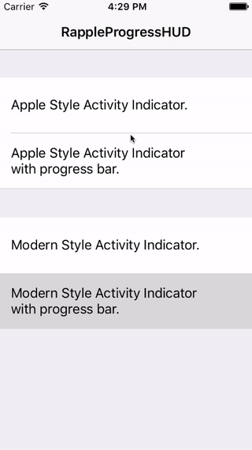

# RappleProgressHUD

[](http://cocoapods.org/pods/RappleProgressHUD)
[](http://cocoapods.org/pods/RappleProgressHUD)
[](http://cocoapods.org/pods/RappleProgressHUD)

## Installation

RappleProgressHUD is available through [CocoaPods](http://cocoapods.org). To install it, simply add the following line to your Podfile:

## Usage

```ruby
pod "RappleProgressHUD" 
```

Then simply import RappleProgressHUD 
```ruby
import RappleProgressHUD
```
</BR>

RappleActivityIndicatorView can be started using any of the starter methods mentioned below. 
When calling these starter methods, two basic input values are required to customize UIs.

###`label` 
this is the text value we are gonna display with the animated indicator

###`attributes` 
this is a dictionary with following Keys.

- `RappleTintColorKey`               Color of the progrss circle and text
- `RappleScreenBGColorKey`           Background color (full screen background)
- `RappleProgressBGColorKey`         Background color around the progress indicator (Only applicable for Apple Style)
- `RappleIndicatorStyleKey`          Style of the ActivityIndicator - see below section for styles
- `RappleProgressBarColorKey`        Progress bar bg color - track bg color
- `RappleProgressBarFillColorKey`    Progress bar filling color with progression - filled track color

In above dictionary we can send 'RappleIndicatorStyleKey' with two styles (see the demo for more details)

- `RappleStyleApple`              Default Apple ActivityIndicator
- `RappleStyleCircle`             Custom Circular ActivityIndicator


RappleActivityIndicatorView has two pre-defines attribute sets for ease of use

####RappleAppleAttributes
Predefined attribute dictionary to match default apple look & feel
- `RappleTintColorKey`               white
- `RappleScreenBGColorKey`           white: 0.0, alpha: 0.2
- `RappleProgressBGColorKey`         white: 0.0, alpha: 0.7
- `RappleIndicatorStyleKey`          RappleStyleApple
- `RappleProgressBarColorKey`        lightGray
- `RappleProgressBarFillColorKey`    white

####RappleModernAttributes
- `RappleTintColorKey`               white
- `RappleScreenBGColorKey`           white: 0.0, alpha: 0.5
- `RappleProgressBGColorKey`         N/A
- `RappleIndicatorStyleKey`          RappleStyleCircle
- `RappleProgressBarColorKey`        lightGray
- `RappleProgressBarFillColorKey`    white

Or we can send any custom made dictionary with these Key values to customize the look and feel


###RappleActivityIndicatorView starter methods

Start Rapple progress indicator using RappleModernAttributes - no text message
```ruby
RappleActivityIndicatorView.startAnimating()
```

Start Rapple progress indicator with custom (or pre-defined) attributes - no text message
```ruby
RappleActivityIndicatorView.startAnimating(attributes: RappleModernAttributes)
```

Start Rapple progress indicator with a text message, using RappleModernAttributes
```ruby
RappleActivityIndicatorView.startAnimatingWithLabel("Processing...")
```

Start Rapple progress indicator with text message and attributes
```ruby
RappleActivityIndicatorView.startAnimatingWithLabel("Processing...", attributes: RappleModernAttributes)
```

Stop Rapple progress indicator
```ruby
RappleActivityIndicatorView.stopAnimating()
```

Start Rapple progress value indicator
- progress amount 0<= progress <= 1.0
- texual progress amount value (e.g. `"3/8"` or `"3/10"`) : limited space avaibale
- textValue `nil`   -> percentage value (e.g. 78%)
- textValue `""`    -> hide texual progress amount
- `RappleStyleApple` will use default apple progress bar
- `RappleStyleCircle` will use curcular progress bar
```ruby
RappleActivityIndicatorView.setProgress(0.2, textValue: "1/5")
```

####How to add progress bar
i. first start progress bar using any of the starter methods
ii. Call `setProgress` methods with or without `textValue:` parameter
```ruby
RappleActivityIndicatorView.startAnimatingWithLabel("Processing...")
RappleActivityIndicatorView.setProgress(0.2, textValue: "1/5")
```
Then gradually increate progress values accordingly - can be called from any thread
```ruby
RappleActivityIndicatorView.setProgress(0.4, textValue: "2/5")
```

Check for RappleActivityIndicatorView visiblility
```ruby
RappleActivityIndicatorView.isVisible()
```


###Demo


## Example Project

To run the example project, clone the repo, and run `pod install` from the Example directory first.

## Author

Rajeev Prasad, rjeprasad@gmail.com

## License
The MIT License (MIT)

Copyright (c) 2016 Rajeev Prasad <rjeprasad@gmail.com>

Permission is hereby granted, free of charge, to any person obtaining a copy
of this software and associated documentation files (the "Software"), to deal
in the Software without restriction, including without limitation the rights
to use, copy, modify, merge, publish, distribute, sublicense, and/or sell
copies of the Software, and to permit persons to whom the Software is
furnished to do so, subject to the following conditions:

The above copyright notice and this permission notice shall be included in
all copies or substantial portions of the Software.

THE SOFTWARE IS PROVIDED "AS IS", WITHOUT WARRANTY OF ANY KIND, EXPRESS OR
IMPLIED, INCLUDING BUT NOT LIMITED TO THE WARRANTIES OF MERCHANTABILITY,
FITNESS FOR A PARTICULAR PURPOSE AND NONINFRINGEMENT. IN NO EVENT SHALL THE
AUTHORS OR COPYRIGHT HOLDERS BE LIABLE FOR ANY CLAIM, DAMAGES OR OTHER
LIABILITY, WHETHER IN AN ACTION OF CONTRACT, TORT OR OTHERWISE, ARISING FROM,
OUT OF OR IN CONNECTION WITH THE SOFTWARE OR THE USE OR OTHER DEALINGS IN
THE SOFTWARE.

